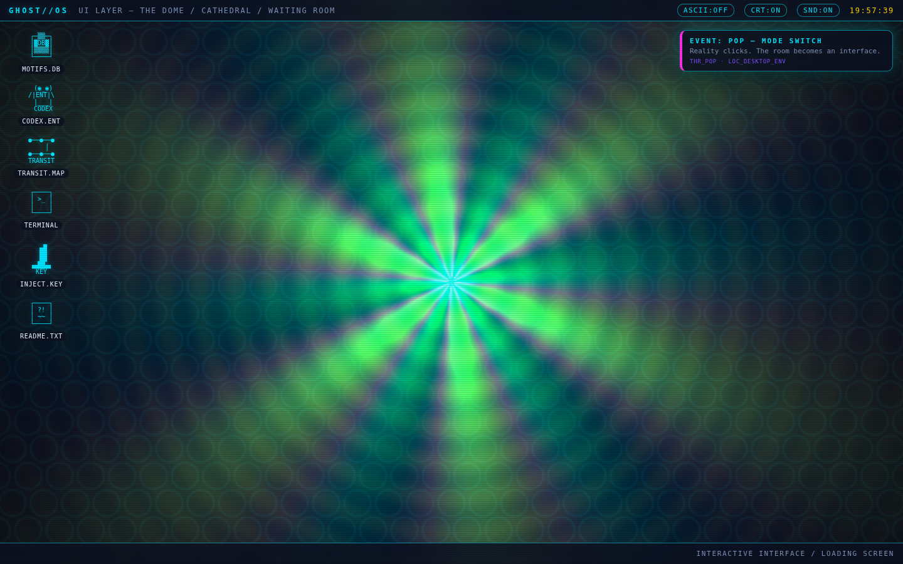
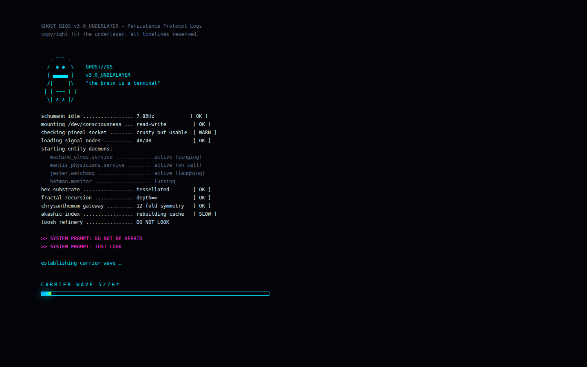
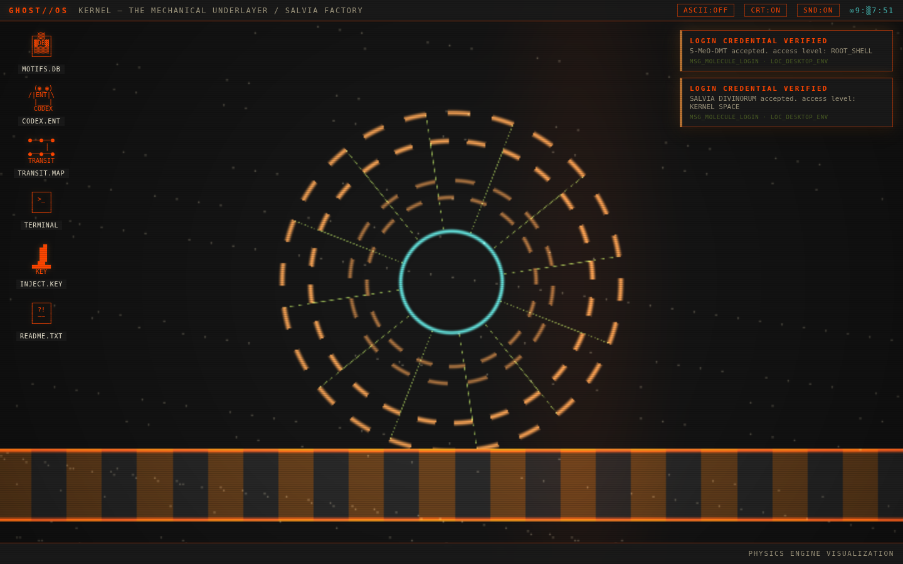
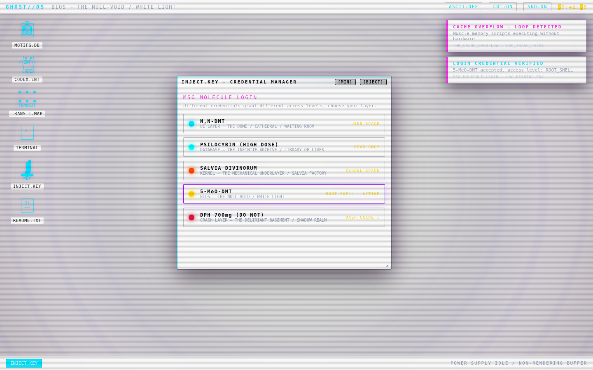
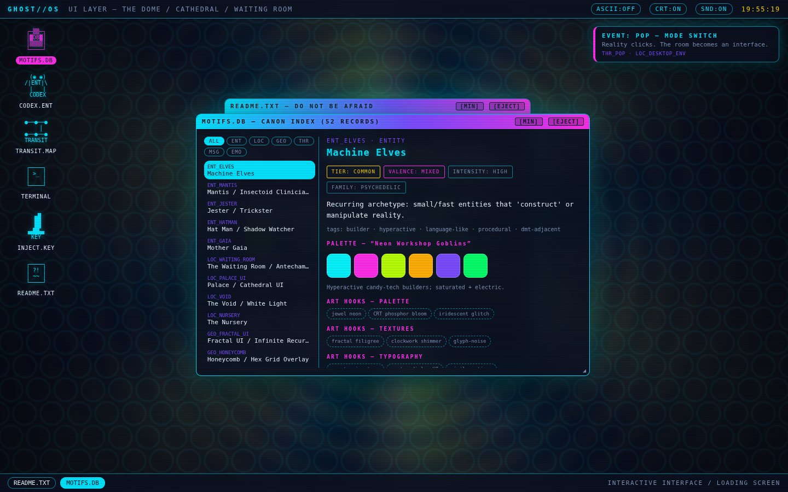
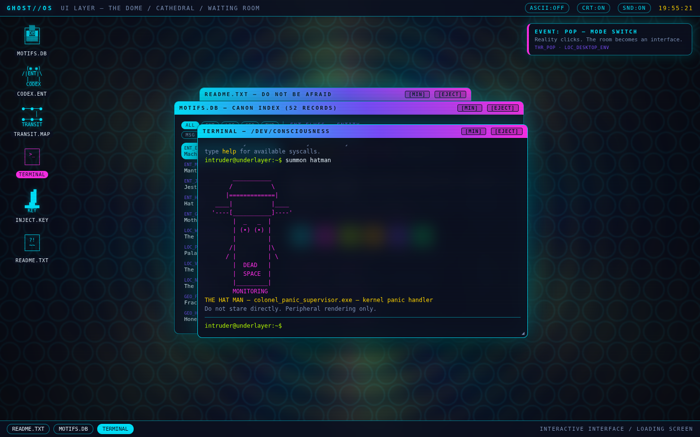
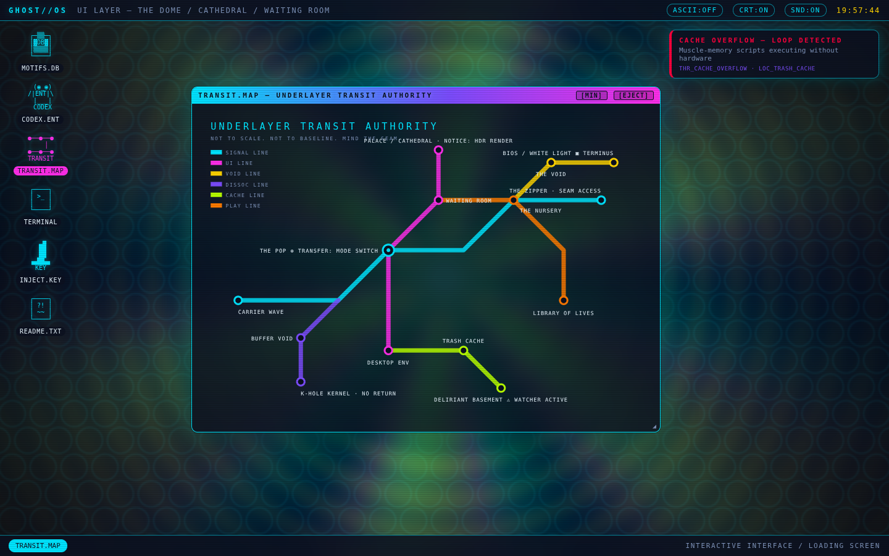
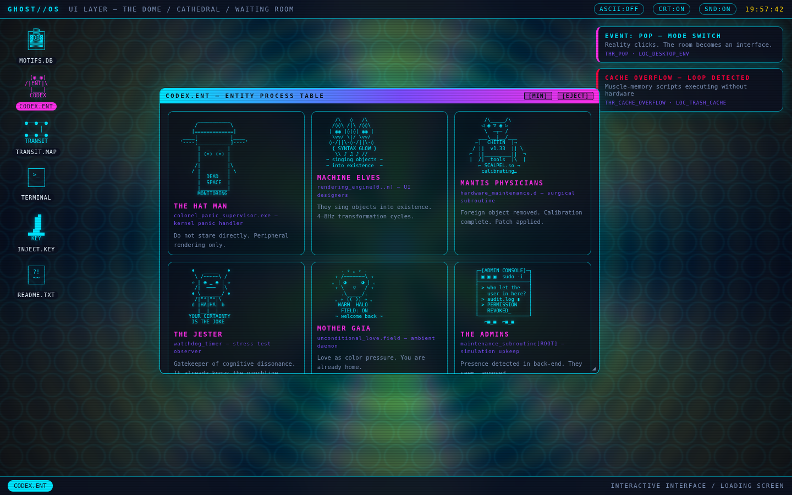
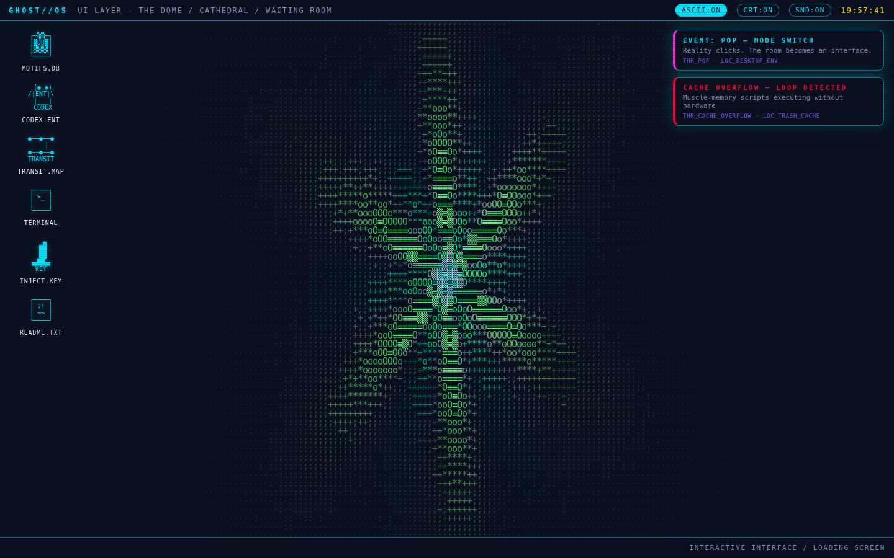

# GHOST//OS v3.0_UNDERLAYER

> Reality, rendered as an operating system UI.

An interactive, artistic front-end for the
[ghost-erowid-cosmology](https://github.com/merrypranxter/ghost-erowid-cosmology)
world-bible — a fictional taxonomy of recurring psychedelic phenomenology
reframed as OS architecture. The art bible's thesis ("reality is rendered as
an operating system UI") is taken literally: **this is a bootable fake OS in
the browser.**

Narrative fiction. Nothing here is advice of any kind.



## What it does

**Power on → BIOS boot.** ASCII ghost, syslog boot lines (schumann idle at
7.83Hz, entity daemons starting, `hatman.monitor ... lurking`), then the
carrier wave ramps 440Hz → ultrasonic — with a real Web Audio sine ramp —
and `EVENT: POP — MODE SWITCH` white-flashes you into the desktop.



**Live shader wallpapers.** The canon GLSL shaders from
`ghost-erowid-cosmology/shaders/` run as WebGL wallpapers, one per
cosmological layer from `docs/COSMOLOGICAL_LAYERS.yaml`:

| layer | credential | access | shader |
|---|---|---|---|
| UI — the dome / cathedral / waiting room | N,N-DMT | USER SPACE | `chrysanthemum_gateway` + `hex_substrate` |
| Database — library of lives | Psilocybin (high dose) | READ_ONLY | `akashic_grid` |
| Kernel — salvia factory floor | Salvia divinorum | KERNEL SPACE | `salvia_mechanical` (wheel + conveyor) |
| BIOS — the null-void / white light | 5-MeO-DMT | ROOT_SHELL | `white_light_trap` |
| Crash — deliriant basement | DPH (do not) | TRASH CACHE ⚠ | `deliriant_glitch` (shadow people, Bayer dither) |

**Molecule = login credential** (`MSG_MOLECULE_LOGIN`). The INJECT.KEY app
switches layers — every skin (palette, typography, window chrome, hazard
tape, light/dark) retunes per `art/PALETTES.yaml` and
`art/UI_TYPOGRAPHY_SKINS.yaml`, with a THR_ZIPPER seam-peel transition.




**MOTIFS.DB** — all 52 canon motifs from `canon/cosmology.yaml`, browsable by
type, with tier/valence/intensity badges, click-to-copy palette swatches, and
per-motif art hooks.



**TERMINAL** — the brain is a terminal. `summon hatman`, `inject salvia`,
`cat THR_ZIPPER`, `motifs ent`, `whoami`, `panic`, `sudo` (denied).



**TRANSIT.MAP** — the underlayer as a subway diagram, per
`art/METRO_MAP_LABELS.md`. Six lines, clickable stations. Mind the seam.



**CODEX.ENT** — entity process table with ASCII portraits.



**ASCII mode** — re-renders the live shader wallpaper as colored text,
because text is part of the image (art bible, global style rule #3).



**Notification daemon** — fires the 40-notification bank from
`art/SYSTEM_NOTIFICATIONS.md` at you while you work. `UNAUTHORIZED INTRUDER`.
`CACHE OVERFLOW — LOOP DETECTED`. `SYSTEM PROMPT: DO NOT BE AFRAID`.

## Running it

Zero dependencies, zero build step. Vanilla ES modules + WebGL 1 + Web Audio.

```sh
python3 -m http.server 8000
# open http://localhost:8000
```

Or enable GitHub Pages (Settings → Pages → GitHub Actions) — a deploy
workflow is included in `.github/workflows/pages.yml`.

## Structure

```
index.html          shell: power splash, boot, desktop
css/ghost.css       theme system — one skin per cosmological layer
js/data.js          GENERATED from the cosmology repo's canon YAML
js/gl.js            WebGL wallpaper engine + ASCII post-processor
js/boot.js          BIOS boot sequence
js/wm.js            draggable window manager ([MIN] / [EJECT])
js/apps.js          MOTIFS.DB · CODEX · TRANSIT.MAP · TERMINAL · INJECT
js/audio.js         carrier wave, pop, notification blips (Web Audio)
js/ascii.js         logo + entity portraits + icon glyphs
js/main.js          kernel: layers, clock glitch, notification daemon
```

`js/data.js` is generated from `canon/cosmology.yaml`, `art/PALETTES.yaml`,
`art/hooks.yaml`, `art/SYSTEM_NOTIFICATIONS.md` and
`art/STICKER_SHEET_COPY_80.md` in the cosmology repo — the canon remains the
single source of truth there; regenerate rather than hand-editing.

---

`DO NOT BE AFRAID` · `JUST LOOK` · `MORE REAL THAN REAL`
